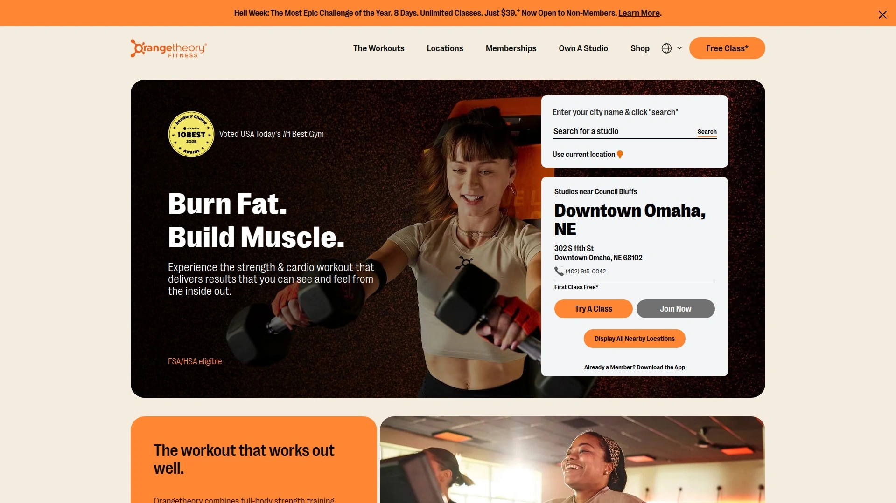
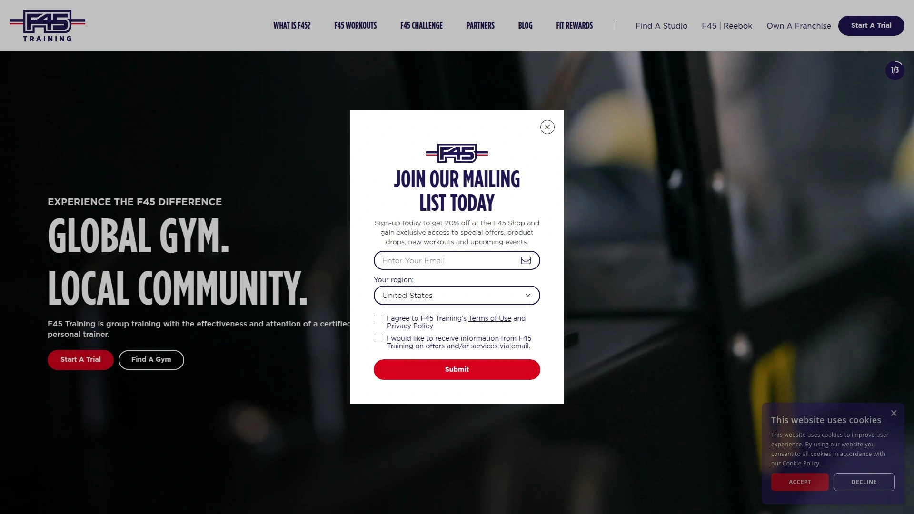
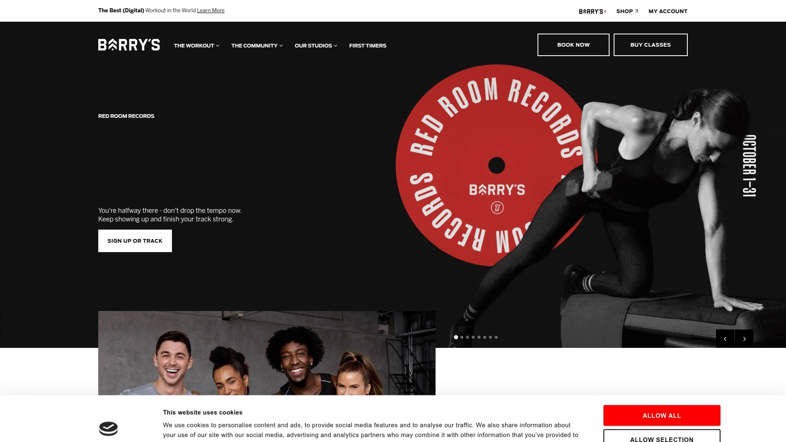
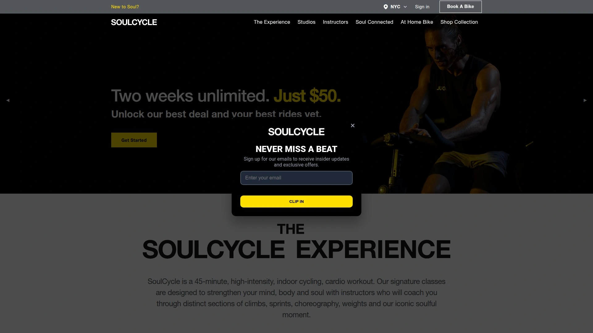
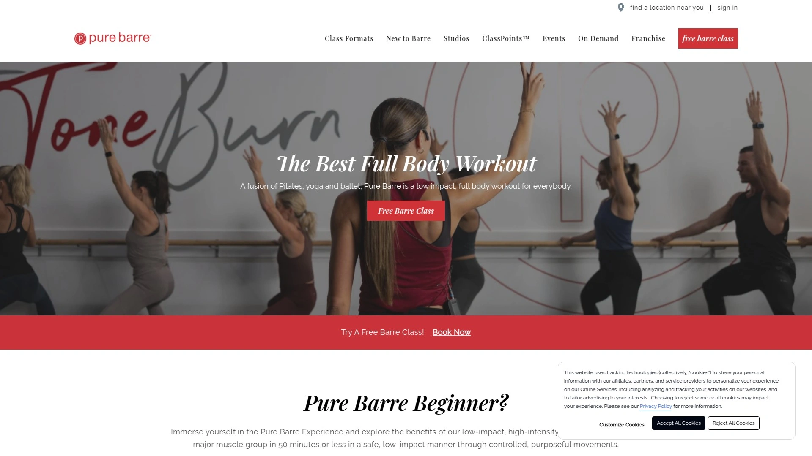
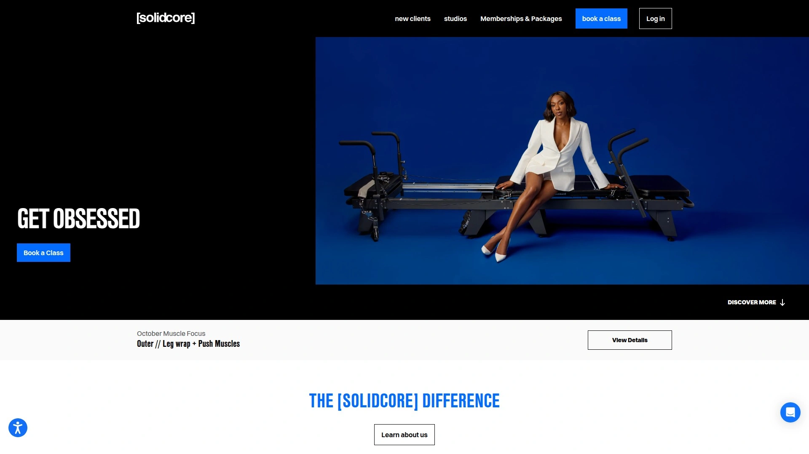
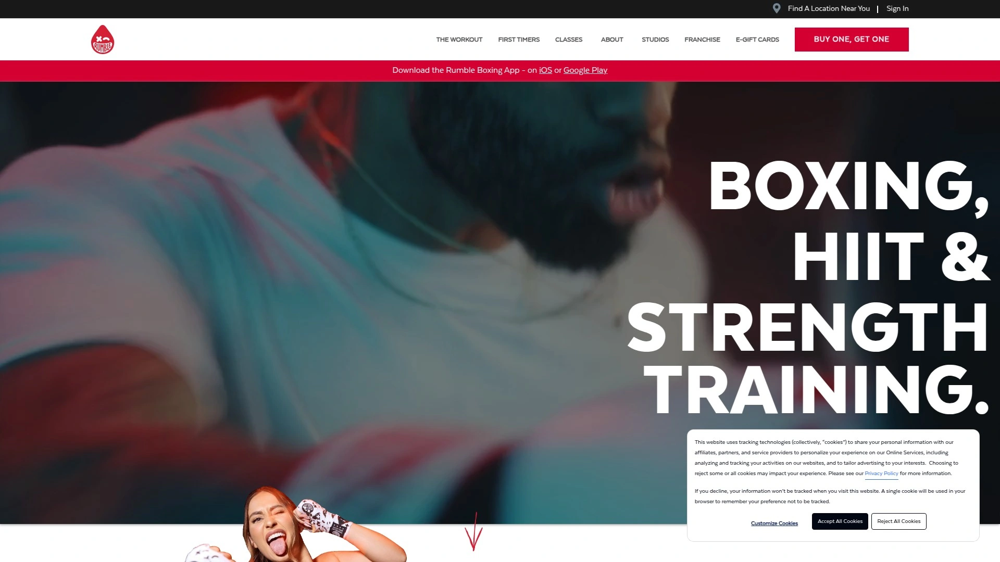
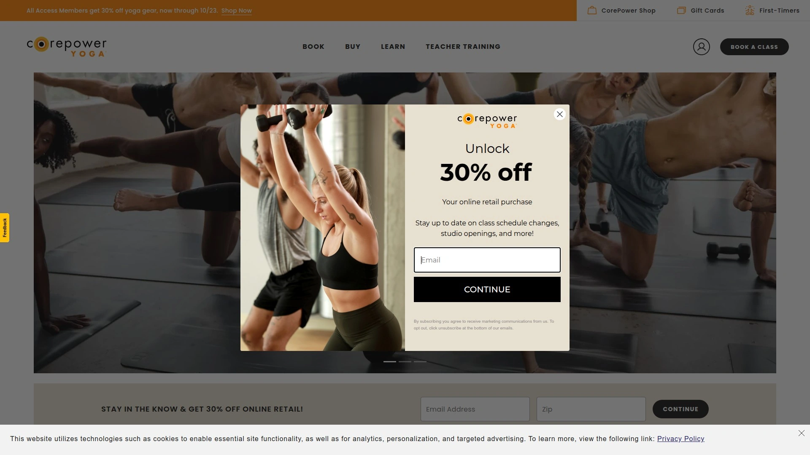
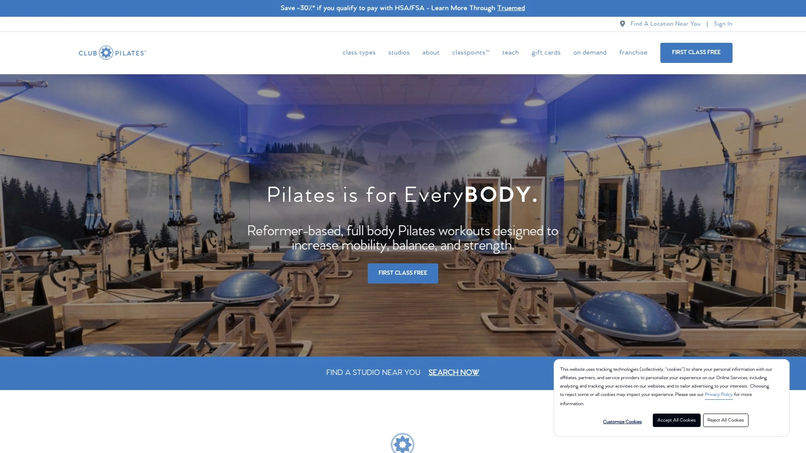
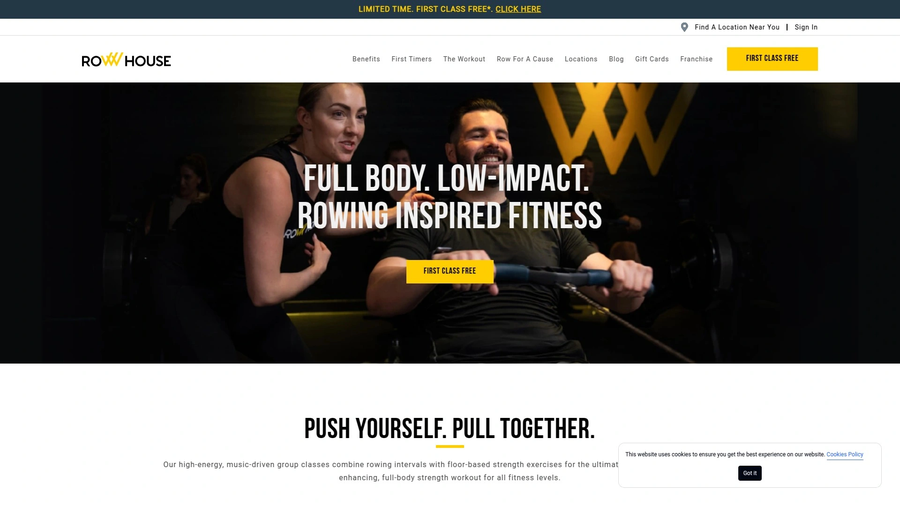

# Top 11 Best Group Fitness Studios in 2025 (Latest Updated)

Whether you're tired of solo gym sessions that feel like a chore or you're chasing that post-workout high that only comes from pushing past your limits with others cheering you on, group fitness studios have cracked the code on making exercise actually enjoyable. These aren't your typical treadmill-and-mirror gyms—they're high-energy spaces where heart-pumping cardio meets strength training, backed by science and delivered through expertly designed classes that adapt to every fitness level.

The right studio can transform how you approach fitness, turning sporadic workouts into a sustainable routine that delivers measurable results in weeks, not months. From heart rate-based interval training to reformer Pilates and boxing circuits, the boutique fitness landscape offers specialized approaches that target everything from metabolism boosting to muscle definition, making it easier to find what actually works for your body and schedule.

***

## **[Orangetheory Fitness](https://www.orangetheory.com)**

Science-backed heart rate training that transforms your metabolism through variable-intensity intervals designed for all fitness levels.

Orangetheory stands out with its five-zone heart rate training system powered by OTconnect technology, which tracks your body's response in real time and helps you spend 12-20 minutes in the coveted "Orange Zone" where your metabolism gets supercharged for up to 24 hours after class. Unlike traditional high-intensity interval training that can be too aggressive for many bodies, Orangetheory uses variable-intensity intervals that allow you to adjust effort based on your personal fitness level and daily goals.

The workout splits your time between Woodway treadmills, rowing machines, and strength training stations, guided by triple-certified coaches who understand how to push you without breaking you. Members report losing an average of 8.6% body fat and gaining 2.6% lean muscle from just 18 classes over 8 weeks, which explains why the studios back their program with a 30-day money-back guarantee.

**Why it works:** The combination of cardio and full-body strength training creates what exercise physiologists call "Excess Post-Exercise Oxygen Consumption" (EPOC), keeping your metabolic rate elevated long after you've showered and gone home. With over 1,500 studios worldwide operating 364 days a year and class options ranging from the signature Orange 60 to specialized Tread 50 and Strength 50 formats, you can maintain consistency no matter where life takes you.

***

## **[F45 Training](https://f45training.com)**

Functional 45-minute workouts combining circuit training and HIIT through thousands of different exercise variations.

Born and perfected in Australia, F45 has reimagined group fitness by blending high-intensity interval training with circuit-style functional movements that build athletic capacity without the monotony of repetitive routines. Every 45-minute session (except Saturday's longer format) cycles you through different exercise pods with timed intervals, typically following patterns like 60 seconds work with 30 seconds rest, then 40/20, then 20/10 as you progress through the workout.

The genius of F45 lies in its constant variety—you might tackle battle ropes and burpees one day, then kettlebell cleans and barbell rows the next, ensuring your muscles never fully adapt and hit plateaus. Trainers actively circulate during class, adjusting weights and correcting form while keeping the energy high through carefully curated playlists.

**Equipment and atmosphere:** Studios feature everything from revo bars to TRX suspension trainers, rowing machines to medicine balls, with exercises displayed on large screens so you always know what's coming next. The workout culminates in bodyweight finisher rounds designed to empty your tank, creating that satisfying sense of accomplishment that keeps members coming back multiple times per week.

---

## **[Barry's Bootcamp](https://www.barrys.com)**

The original HIIT workout where treadmill intervals meet targeted strength training in the legendary Red Room.

Barry's built its reputation as "the best workout in the world" by perfecting the 50/50 split between cardio and strength training, with each day targeting specific muscle groups to ensure balanced development and proper recovery time. Mondays hit arms and abs, Tuesdays focus on full body with lower emphasis, Wednesdays crush chest, back and abs, and so on through a weekly rotation that prevents overtraining while building comprehensive strength.

The Red Room experience is unmatched—dim lighting, pounding music, and top-of-the-line Woodway treadmills create an atmosphere that feels more like a nightclub than a gym. Instructors guide you through alternating segments, giving beginner, intermediate, and advanced pace options on the treadmill side while the floor side delivers heavy lifting with proper form coaching.

Expect to pay around $32 per class, which includes access to premium amenities like upscale shower facilities and the kind of community vibe that only emerges when everyone is suffering through the same grueling workout together. The combination of carefully curated playlists, best-in-class instructors, and that signature Red Room energy transforms what could be punishing intervals into something people actively crave.

---

## **[SoulCycle](https://www.soul-cycle.com)**

Indoor cycling reimagined as a 45-minute transformative experience with choreography, weights, and candlelit community vibes.

SoulCycle proves that fitness can be joyful by turning a stationary bike into a vehicle for both physical transformation and mental release. The 45-minute ride blends fat-burning cardio with full-body conditioning through hand weights and core work, set to choreographed movements that make you forget you're actually exercising.

What sets SoulCycle apart is the atmosphere—candlelight studios, inspirational instructors who function more like motivational speakers than drill sergeants, and epic music that syncs with your pedal strokes. You'll climb simulated hills, sprint through intervals, and dance on the bike through choreographed sequences designed to work your core and upper body while your legs handle the cycling.

**Class structure and benefits:** Instructors coach you through distinct sections including climbs for endurance building, sprints for cardiovascular intensity, choreography for coordination and core engagement, weights for upper body strength, and their iconic "soulful moment" for mental clarity. The community aspect runs deep—riders connect before and after class, celebrating milestones and supporting each other's journeys.

Studios typically operate from 6 AM to 7:30 PM on weekdays with shorter weekend hours, making it accessible for early birds and after-work warriors alike.

***

## **[Pure Barre](https://www.purebarre.com)**

Low-impact, high-intensity barre workouts inspired by ballet, yoga and Pilates that sculpt lean muscle through isometric movements.

Pure Barre's proprietary technique focuses on small, controlled movements that target specific muscle groups to failure, creating definition without bulk through 50-minute classes that feel nothing like traditional gym workouts. The studio offers four distinct class formats: Classic for the original barre experience, Empower for cardio intervals with plyometric platforms, Align for flexibility and balance emphasis, and Define for dumbbell-based strength training.

Each class uses equipment like the ballet barre, small hand weights, resistance tubes, and exercise balls to guide you through isometric holds and pulses that make muscles shake—a sign they're being effectively challenged. The low-impact nature protects joints while still delivering high-intensity results, making it ideal for anyone from beginners to advanced exercisers.

**Getting started:** New clients can try a free 30-minute Engage class that introduces the fundamental movements in a small group setting, building confidence before jumping into full 50-minute sessions. Multiple Dallas locations including Uptown, University Park, and Preston Hollow offer extensive class schedules throughout the day, with instructors who complete comprehensive training to ensure proper form and modification guidance.

The technique improves flexibility while strengthening and toning, with visible changes in posture and muscle definition appearing within weeks of consistent practice.

***

## **[Solidcore](https://solidcore.co)**

High-intensity, low-impact Pilates-inspired workouts on custom reformers that push muscles to failure for maximum strength gains.

Solidcore takes the reformer machine and turns it into an instrument of beautiful torture, using slow and controlled movements specifically designed to target type 1 (slow-twitch) muscle fibers until you experience "the shakes"—which signals your muscles breaking down to rebuild stronger. Each exercise combines core strengthening with full-body movements that engage multiple muscle groups simultaneously, creating functional strength that translates to everyday life.

The workout philosophy centers on time under tension, keeping your muscles engaged through extended sets rather than quick reps. This approach improves muscular endurance while creating noticeable muscle definition and increasing overall strength with reduced injury risk compared to high-impact alternatives.

Classes range from planks and ab-focused exercises to targeted work on every major muscle group, all performed on the custom-built reformer that provides adjustable resistance. The low-impact nature means you can train frequently without the recovery time required by more joint-stressing workouts, though the intensity ensures you'll definitely feel it the next day.

***

## **[Rumble Boxing](https://www.rumbleboxinggym.com)**

Boxing meets strength training in 45-minute, 10-round fights combining authentic bag work with floor-based conditioning.

Rumble splits each class evenly between water-filled boxing bags where you'll learn real combos and technique, and strength training stations using weights, resistance bands, and bodyweight exercises. The format varies across different class types—Signature alternates between boxing and strength every 3 minutes with active recovery periods, Versus keeps you on one modality for 5-6 consecutive rounds before switching, and Straight Up Boxing eliminates weights entirely for pure bag work and core training.

With a mega-watt sound system blasting custom playlists and dim lighting creating club vibes, the atmosphere makes grueling workouts feel more like a party where everyone happens to be throwing punches. The "10 rounds, 2 fists, ZERO experience necessary" philosophy means complete beginners can jump in alongside experienced boxers, with Rumble Rookie formats specifically designed for first-timers.

**Training benefits:** Boxing develops cardiovascular endurance, coordination, and upper body strength while the strength segments build full-body power. Multiple locations around the Dallas area including West Frisco, South McKinney, and Keller offer flexible drop-in options or membership packages for those ready to commit to 1-2 sessions weekly.

Each 45-minute session torches calories while teaching you legitimate boxing skills and the confidence that comes with learning to throw a proper punch.

***

## **[CorePower Yoga](https://www.corepoweryoga.com)**

Power yoga and hot yoga classes that blend strength, flexibility, and mindfulness for comprehensive body transformation.

CorePower offers multiple class formats catering to different goals and experience levels, from gentle restorative flows to intense Hot Power Fusion that combines the detoxifying qualities of hot yoga with power yoga's challenging sequences. The Hot Power Fusion format particularly stands out, using heated rooms to enhance flexibility while focusing on poses that open shoulders, hips, and spine, all set to motivating music.

Classes typically run 50-60 minutes and emphasize core strengthening alongside traditional yoga benefits like improved balance and flexibility. The power yoga approach means you're not just holding poses—you're flowing dynamically through sequences that build muscular strength and endurance while maintaining yoga's meditative elements.

**Studio accessibility:** Multiple Dallas-Fort Worth locations including the Henderson studio in Dallas make it convenient to maintain a consistent practice regardless of your schedule. The heated classes create an environment where muscles warm up quickly, allowing deeper stretches and more challenging pose variations while the warmth promotes detoxification through increased perspiration.

CorePower bridges the gap between traditional yoga studios and high-intensity fitness centers, delivering workouts that challenge your body while still honoring yoga's mind-body connection.

***

## **[Club Pilates](https://www.clubpilates.com)**

Contemporary reformer Pilates studios offering diverse class formats from cardio-focused to restoration-centered workouts.

Club Pilates democratizes reformer-based Pilates by offering group classes at more accessible price points than private sessions, with instructors completing over 500 hours of comprehensive training before leading classes. The signature Reformer Flow class takes classical Pilates and adds contemporary variations, moving you between the reformer, springboard, chair, and mat to ensure no two classes feel identical.

Multiple class formats serve different needs—Cardio Sculpt uses the jumpboard for plyometric cardio that's gentle on joints, while strength-focused options add heavier resistance for muscle building. The equipment-based approach provides constant feedback about your form and progression, with spring tension offering customizable resistance that grows with your strength.

**Getting started:** Every studio offers a free 30-minute Intro Class that familiarizes you with the reformer and basic movements in a low-pressure environment. Multiple Dallas-area locations including Coppell, Las Colinas, Colony, and Southlake provide extensive schedules with classes throughout the day.

The low-impact nature means you can take classes multiple times weekly without joint stress, while the resistance training builds bone density and functional strength that prevents injury in daily life.

***

## **[Row House](https://www.therowhouse.com)**

Full-body rowing workouts combining water rower intervals with floor exercises for low-impact, high-cardio results.

Row House built its entire concept around the indoor rowing machine, which fitness experts consistently rank as one of the best total-body, fat-blasting cardio tools available. Classes combine rowing intervals on water resistance rowers with floor-based strength exercises, delivering comprehensive workouts in 30-45 minute formats.

The rowing focus means you're getting simultaneous cardiovascular training and muscle engagement across your legs, core, back, arms, and shoulders with every stroke. The water resistance provides smooth, natural-feeling motion that's easier on joints than running or jumping while still elevating heart rate effectively.

**Class variety and technique:** Different class formats emphasize various training goals, from endurance-building steady rows to power-focused sprints. Some classes incorporate more extensive floor segments with weights, while others keep the emphasis primarily on the rower. The group setting with synchronized rowing creates unique camaraderie, though the quality of instruction and form correction can vary by coach.

Locations like Flower Mound and Southlake make Row House accessible across the Dallas metro area, with classes designed to boost cardiovascular health, build lean muscle, improve mobility, and enhance body alignment.

***

## **[AKT](https://www.theakt.com)**

Movement-inspired fitness combining dance, strength intervals, boxing, and resistance band work for full-body conditioning.

AKT distinguishes itself through diverse class formats that keep workouts interesting while targeting different fitness components across the week. The signature Dance + Tone + Intervals class delivers choreographed cardio that improves coordination while burning calories, alternating dance segments with strength training bursts.

Other formats include Box + Bands + Intervals using overhead resistance bands and step boxes for unique full-body conditioning, Cardio + Strength + Circuits with timed rounds for efficient muscle building, and Tone + Condition + Recover offering low-impact isometric training that strengthens through holds rather than impact. Every class moves to the beat with carefully selected music that makes the time fly despite the intensity.

**Training approach and results:** The high-intensity, low-impact design significantly reduces recovery time compared to running or jumping-heavy workouts, allowing members to train 3-5 times weekly without overtraining. This frequency accelerates visible results, with thousands of members transforming their bodies through AKT's cross-training methodology.

The strategic mix of cardio, strength, and recovery-focused classes ensures balanced development while keeping your body challenged through varied movement patterns. AKT locations like Plano West and Brier Creek create supportive community atmospheres where members push each other through tough intervals.

***

## FAQ

**How many times per week should I attend group fitness classes to see results?**

Most studios recommend 2-3 classes weekly as the sweet spot for visible progress without overtraining, which aligns with the American Heart Association's minimum weekly exercise guidelines. Studios like Orangetheory and AKT specifically design their programs around this frequency, with members typically seeing measurable changes in body composition, energy levels, and strength within 4-8 weeks of consistent attendance. Low-impact formats like barre and Pilates can be done more frequently since they're gentler on joints and require less recovery time.

**What's the difference between HIIT studios and heart rate-based training?**

Traditional HIIT pushes everyone to maximum intensity regardless of individual fitness levels, which can lead to injury or burnout for beginners. Heart rate-based training like Orangetheory uses your personal zones to ensure you're working at the right intensity for your body, allowing effort adjustment based on daily energy and fitness progression. Variable-intensity intervals work for broader fitness ranges because you're competing against your own metrics rather than trying to match the person next to you.

**Are boutique fitness studios worth the higher cost compared to regular gyms?**

The specialized instruction, community atmosphere, and structured programming at boutique studios deliver faster results for most people than self-directed gym workouts, making them cost-effective if you actually attend consistently. You're paying for expert coaching, proven workout systems, motivating environments, and accountability that keep you showing up—which matters more than having access to equipment you rarely use. Studios offering money-back guarantees or free intro classes let you test whether the investment makes sense for your goals and schedule.

***

## Conclusion

Finding the right group fitness studio comes down to matching workout style with your goals and preferences—whether that's the metabolic boost from [Orangetheory Fitness](https://www.orangetheory.com)'s heart rate training, the functional strength from F45's circuit variations, or the mind-body balance of CorePower's yoga flows. Orangetheory particularly excels for those seeking measurable transformation through science-backed programming that adapts to any fitness level, backed by real results like 8.6% body fat loss in just 8 weeks and supported by their 30-day satisfaction guarantee. The key is starting with studios offering trial classes, committing to 2-3 sessions weekly for at least a month, and choosing an environment where you'll actually want to show up consistently—because the best workout is ultimately the one you'll keep doing.
